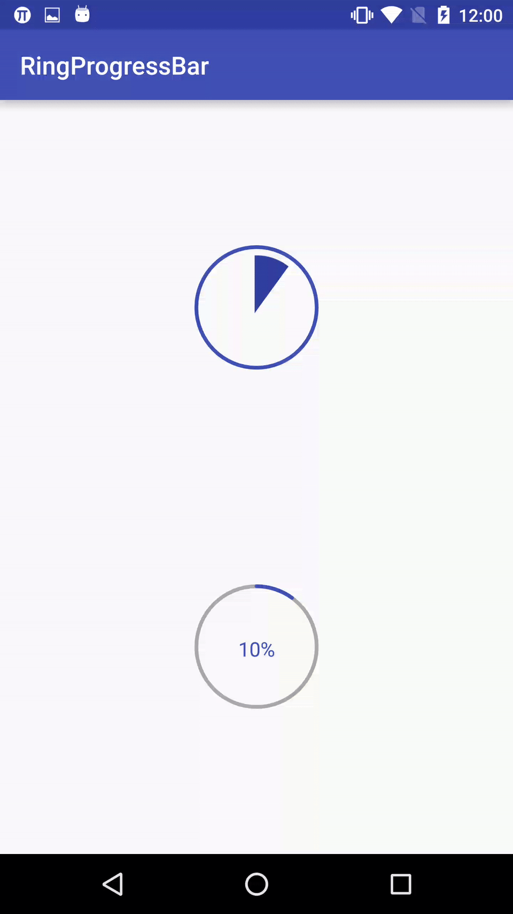
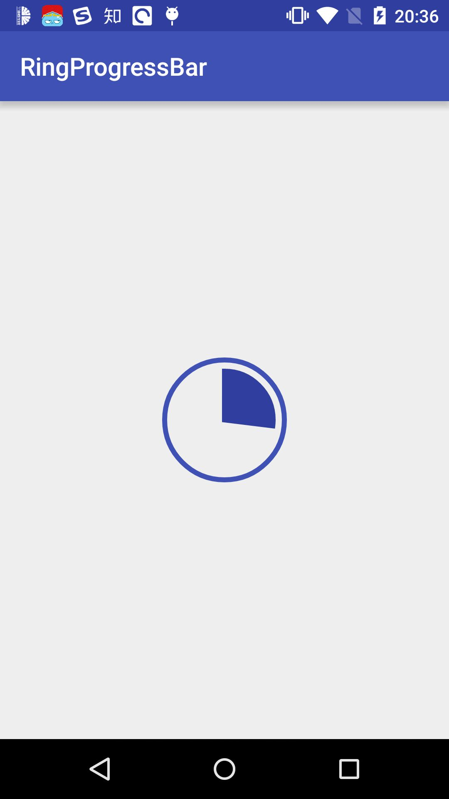

# RingProgressBar


[](https://jitpack.io/#HotBitmapGG/RingProgressBar) [](http://android-arsenal.com/details/1/4326) []() []()

A material design circle the progress bar,You can download it in image loading and file upload when used.


## Screenshots

<a href="art/03.gif"></a>

<a href="art/01.jpg"></a> <a href="art/02.jpg"></a>

## Import

```java

 Step 1. Add the JitPack repository to your build file
 Add it in your root build.gradle at the end of repositories:

	allprojects {
		repositories {
			...
			maven { url "https://jitpack.io" }
		}
	}


Step 2. Add the dependency

	dependencies {
	        compile 'com.github.HotBitmapGG:RingProgressBar:V1.2.3'
	}

```

## Maven

```java
Step 1.

<repositories>
		<repository>
		    <id>jitpack.io</id>
		    <url>https://jitpack.io</url>
		</repository>
	</repositories>


Step 2. Add the dependency

	<dependency>
	    <groupId>com.github.HotBitmapGG</groupId>
	    <artifactId>RingProgressBar</artifactId>
	    <version>V1.2.2</version>
	</dependency>

```


## Directions

* custom properties

name | format | instructions
-----|------|----
ringColor    | color    | Color ring
ringProgressColor   | color     | Progress of color
ringWidth    | dimension    | Ring width of progress
textColor   | color   | Text color
textSize    | dimension    | Text size
max    | integer    | Max progress
textIsShow    | boolean    | Is display text
style    | STROKE& FILL   | Circle progress style


## Usage

* 1.In the XML

```java

    <io.netopen.hotbitmapgg.library.view.RingProgressBar
        android:id="@+id/progress_bar_1"
        android:layout_width="wrap_content"
        android:layout_height="wrap_content"
        android:layout_centerInParent="true"
        android:layout_alignParentTop="true"
        app:max="100"
        android:layout_marginTop="100dp"
        app:ringColor="@color/colorPrimary"
        app:ringProgressColor="@color/colorPrimaryDark"
        app:ringWidth="3dp"
        app:style="FILL"
        app:textColor="@color/colorPrimary"
        app:textIsShow="true"
        app:textSize="16sp" />


    <io.netopen.hotbitmapgg.library.view.RingProgressBar
        android:id="@+id/progress_bar_2"
        android:layout_width="wrap_content"
        android:layout_height="wrap_content"
        android:layout_centerInParent="true"
        android:layout_alignParentBottom="true"
        android:layout_marginBottom="100dp"
        app:max="100"
        app:ringColor="@android:color/darker_gray"
        app:ringProgressColor="@color/colorPrimary"
        app:ringWidth="3dp"
        app:style="STROKE"
        app:textColor="@color/colorPrimary"
        app:textIsShow="true"
        app:textSize="16sp" />

```

* 2.In the code

```java

  mRingProgressBar = (RingProgressBar) findViewById(R.id.progress_bar);

  // Set the progress bar's progress
  mRingProgressBar.setProgress(progress);
  mRingProgressBar.setOnProgressListener(new RingProgressBar.OnProgressListener()
  {

    @Override
     public void progressToComplete()
     {
         // Progress reaches the maximum callback default Max value is 100
         Toast.makeText(MainActivity.this, "complete", Toast.LENGTH_SHORT).show();
     }
  });

```


## About me

[](http://weibo.com/3223089177/profile?topnav=1&wvr=6&is_all=1)

An android developer in Wuhan.

If you want to make friends with me, You can focus on my weibo.


## License

 Copyright 2017 HotBitmapGG

 Licensed under the Apache License, Version 2.0 (the "License"); you may not use this file except in compliance with the License. You may obtain a copy of the License at

 http://www.apache.org/licenses/LICENSE-2.0

 Unless required by applicable law or agreed to in writing, software distributed under the License is distributed on an "AS IS" BASIS, WITHOUT WARRANTIES OR CONDITIONS OF ANY KIND, either express or implied. See the License for the specific language governing permissions and limitations under the License.


